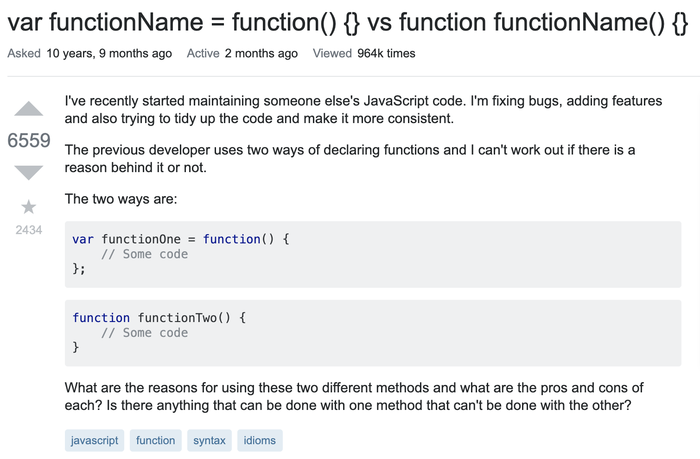
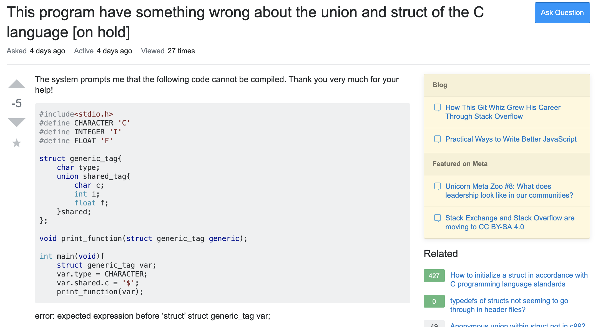

# Is your question stupid? 🤔

It does not have to be. 


No one should feel ashamed to ask any sort of questions......except for the stupid ones. When I say stupid ones I mean the **STUPID** ones. Question may be asked if given the correct structure and wording. That being said, anything could be a question. But that brings another real question? 


## Are your questions worth asking? 

Do you already know the answer to your question? Say you're going to ask me "What day is it?", that should be something you could answer yourself. If you cannot answer that question, google it. Can google give you what you are asking, if yes, then your question is not worth asking. If no, let's find out how we can answer your question.  


***so what is your question?.....***


What is it that you are trying to figure out? Who can we ask for help, how can we ask for help? Once something like that is figured out, let's form a propper question adjusted to whomever/wherever we are it asking to. 


## How do we ask a smart question? 

Say we are on [Stack Overflow](https://stackoverflow.com/) and you want to ask a question in this community. What you will need to do is: 

* Write a title that summarizes you problem 
  * Your title is the first thing they see, make it clear and be specific as you can.
* Be sure to be aware of your spelling errors and grammar because those are important.
* Introduce what your problem is before providing any code
* Add tags
* Proof read
  * Act as if this is a proffessional email to your boss/co-worker/teacher
  
Post your question, wait for a response. 
  

## Here below are examples of a good and bad question 





This user provided a clear, specific title. A needed and simple introduction/background information for what was going on, and gave a snipet of code for anyone to see. The author gave a question that was specific that could not have been googled. 





While this user provided a specific question, brief introduction and code it is not a good question. The reason why is that the author did not read inspect their code. On the bottom of the image, it directs the programmer to where the error was. It says where to look and what the error is. All they had needed to change was:


```
int main(void) [

// to 

int main(void) {

```


Providing a clear and concise question can be hard to do, so do not feel bad about having a shitty question every now and then. Besides stupid questions are sometimes the best questions, I can answer them, but they could also be the most annoying. 

Just be sure to ask your question in the smart way. 

***The devil is in the details after all*** 😈
