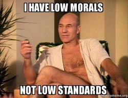
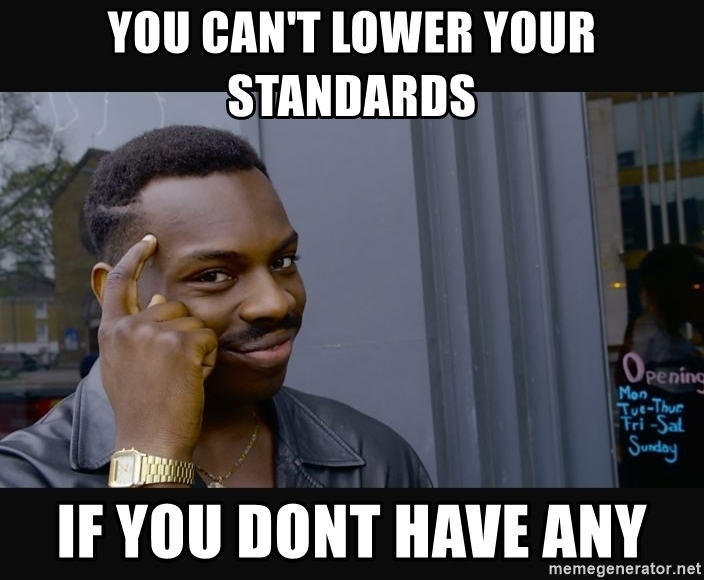

**I have standards.** Standards help me navigate what I want and set the bar for expectations. I have standards in the way I present myself, the expectations I have for what I want, and the people I want. I, just like code have standards. And that is not a bad thing.

Coding standards are extremely beneficial for everyone. It can help you learn a programming language. Coding standards give structure and eaze. It is indeed tedious, but again very beneficial. Coding standards make it so that everything looks clean and exactly how you need to expect. It gives you the package deal of attention to detail and explanation which can help you so much when you are navigating unfamiliar code. 

Coding standards is not gonna guarantee understanding code, but it is more of a good starting point with where to go. It is like dating. You figure out what you do and do not want and set the standard of what you are looking for. It gets you to a starting point that reeps beneficial to you. Gives you one less thing to worry about when you know it is read and edited to its standards. These reasons are why I think coding standards can help yo
u learn to program. It lays it all out for you for those that are slow. Like me. 

Although it is very helpful, it is blissfully painful. Clean code comes at a cost and for me, that cost is my sanity. Let me tell you, I live for the check mark that tells me it's good. I am sad I know. I will take all the validation I can get even if it means suffering through my code and fixing every dumb “error-ettiquete” to the tee. So yes, I have a love hate relationship with code standards, but who doesn’t.

And if you don’t… Well let me tell you at least this.

