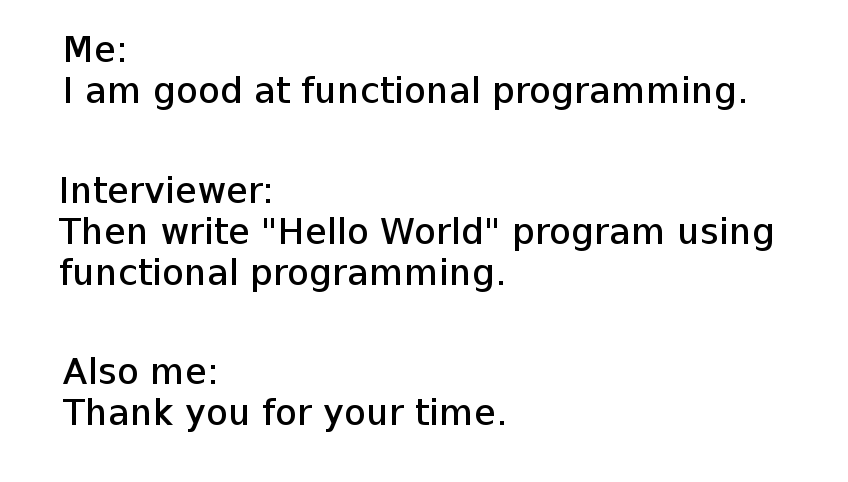

# It's the Javascript for me

I will admit, I am a ***slow*** learner/thinker. Emphasis on the ***slow*** I make many mistakes, small mistakes and it really does slow me down. What I like about Javascript is the amount of shortcuts I can take to create something. It is like writing as little as possible which is what I say is a programmers dream. To just copy, paste, and write a little in. It is a scripting language, so that means it doesn’t need to be compiled to be executed. I also like how reactive (to user actions in real-time) and that it is a great to use in programming interviews like our WOD.

But of course, all good things must have a bad and some of the bad are just… let’s say a little stupid. Okay first of all **==** and **===** like why? Yeah i know stupid, I mean stupid.  Also I sometimes think it’s just hard to read but then again, I am slow. 

**## Ok let me rephrase this...**
So okay truthfully it’s a good programming language. It’s versatile, widely used, and not too hard for a slow learner like me to pick up (well not without the help of Prof. Johnson and his WODs, which sounds like this has me biased but that is a conversation I do not want to talk about lol).  WOD (workout of the day) has really helped me practice becoming a better programmer by preparing me for real life scenarios like interviews. It is stressful very much because I do have a hard time but it has proven itself as a language to me. 

