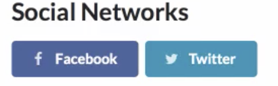

Over my course of learning code, I have had my fair share of misunderstandings of syntax. I have always had a harder time following along, learning and getting my syntax right, especially with my learning disabilities. So over the course of the past few weeks I have divulged myself into learning a UI framework, Semantic UI. It was a bit tedious needless to say, I invested a lot of my time to try to understand what I was doing. I still have trouble at times, but what I have found and gained in return in that investment helped me a lot more. 

 

I enjoy making things look pretty, I do. But doing it through just raw HTML/CSS is so time consuming and hard. With Semantic UI on the other hand, it made my life a lot easier. It really is not like anything I have learned before. Here are some things I like about Semantic UI: 

 

* Self-explanatory and easy to read
* Easy to use, looks nice
* Different Variations of choice
* A lot less complicated 

 

***Let’s take a look at an example of how nice Semantic UI can be***

 

We take this code: 
 

`<a href="url link">Facebook</a>`
 

And it will look something like this:

 

 

Whereas with Semantic UI, your easy to read code would be presented like this:

 

`<button class="ui facebook button">
  <i class="facebook icon"></i>
  Facebook
</button>`
`<button class="ui twitter button">
  <i class="twitter icon"></i>
  Twitter
</button>`

 

 

So far, my experience with Semantic UI has been positive, I have not had much experience with any other frameworks before Semantic UI, and I am glad this was my first introduction as it has left me with a positive experience. I am looking forward to learn what else I can do and integrate with Semantic UI.

 

**oh Semantic UI, you are just.... 

 

