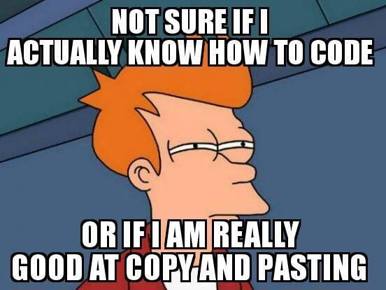
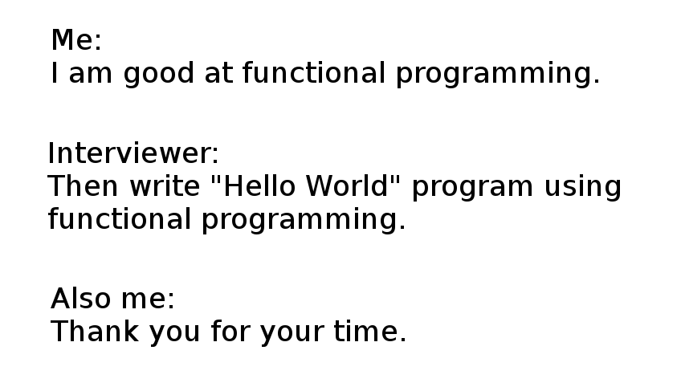

**Hi my name is Jessica and I am a programmer.**

It took me a long time before I was able to say that. I have taken many CS classes but I never felt like I was able to own that identity until I learned javascript. For so long, I have always doubted whether I could do it, if I was good enough or even smart enough. I always felt I had something to prove to myself before I could call myself a programmer. I always struggled, and I still do. I felt like a fraud for being so far into computer science but yet not knowing what I was doing. But the truth is, **no one** actually knows what they are doing.

I wish javascript was the first language I learned, it would have been more encouraging to me in learning new languages. I was always so confused with Java and C/C++, I felt so frustrated. But javascript is different, it is challenging but exciting. There is so much I could do and I never felt more creative in a language than I do now with javascript. 

So I recently started doing the 100 days of code challenge. I want to build strong consistent coding habits, and I thought that I would do this challenge with javascript. My professor is very fond of doing Work out of the Days (WODs) and it felt like this challenge goes hand in hand. I will be honest, WODs do stress me out and sometimes I feel like I am going to shit myself. I thought, what better way to do reassure myself in skill and school. 

So maybe at the end of the challenge I will be a javascript **GOD**. (Watch out Professor Johnson, I am taking the title). Or maybe I will need to get a bunch of new pants. We will see. My fingers are crossed, I have high hopes for that title. One things for sure, 

            **My Name is Jessica and I am a programmer**

