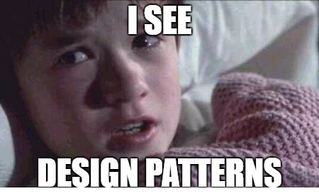

Whether you know it or not we use patterns in our everyday life. It is the foundation of what helps us understand how we view our world, our lives. Patterns help us understand each other, organize our thoughts, and create order. It is an essential part of how we live our lives. It makes our lives easier, which is why it can be clear to see why design patterns are important. 

 

 

Whether you are a programmer or have some sort of understanding of design patterns or not, you will start to notice how a design pattern can influence your decisions. Say you are surfing the internet, you are scrolling through some Buzzfeed shopping, and you see *"20 Must-Have Items Everyone Swears By".* You scroll, and you find something you want to buy. You click on the link, and you are on that product's webpage. It could literally take you seconds, and you already know how to interact with this webpage. You understand the structure of it because it's like a lot of the shopping sites you've already been on. And that design was intentional. Many websites use common design Patterns. There is an advantage to this because adopting common patterns can be used as leverage and can create ease with interaction. 

 

When designing a product you have to ask, *"Who is this product for?".* It is for our end-user and our programmers. Designing patterns can not only make the interaction between the user and the end product better but make communication between designers better. It’s like a short-hand way of communicating. Understanding how it will be laid out in common practice can make the process of developing something more seamless and have it easier for any other developer interacting with it easier for them to understand. 

 

There are various kinds of designs out there and not everyone will use every pattern. There are products there where a singleton design may be more beneficial to use than a factory pattern design. That is why it is important to keep in mind just like design patterns in code and jeans, **one size does not fit all.** 

 

 

