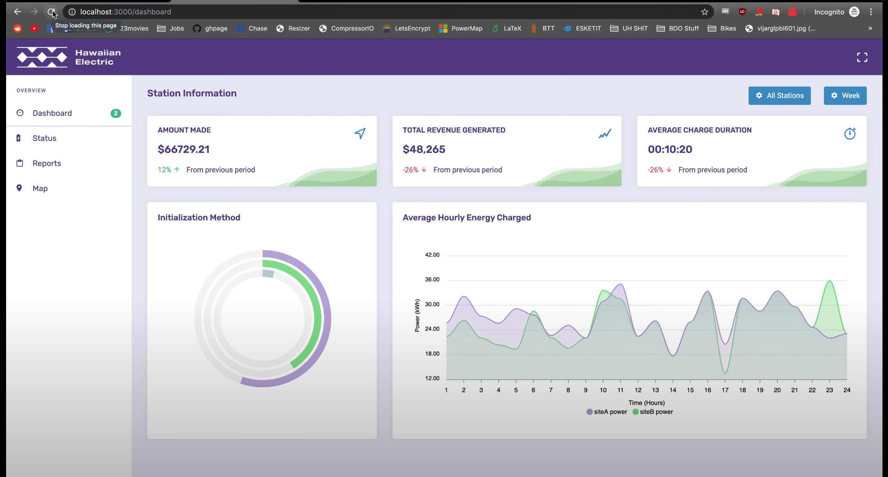
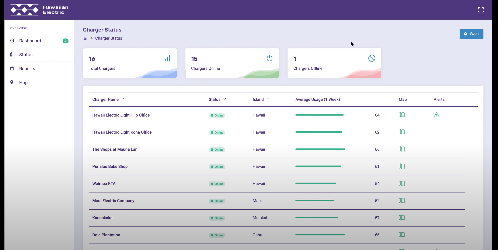

  

 

In Fall 2019, my team and I got third place at HACC2019. The Honolulu Annual Code Challenge (HACC) is a competition is that is "designed to engage the community in modernizing state functions". My team and I created Electrical Vehicle Charging Station Analysis that helps see potential problems with EV charging stations in Hawai'i by collecting data. 

 

  
  
Data Visualization Dashboard 

 

  
  
EV station dashboard visualization

 

The challenges we faced in grading was:
  - Originallity
  - Design
  - Resillience
  - Utility and Impact
  - Team Collaboration
  - Presentation

 

#### My Contribution:
* Developed back-end database connections
* Worked on front-end graph design using D3.js
* Sorted and parsed EV data

 

My teams' [project video](https://devpost.com/software/volts-wagon) 

 
 

