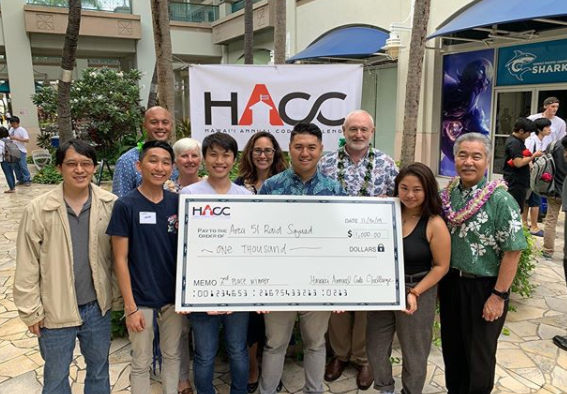

In Fall 2019, my team and I got third place at HACC2019. The Honolulu Annual Code Challenge (HACC) is a competition is that is "designed to engage the community in modernizing state functions". My team and I created Electrical Vehicle Charging Station Analysis that helps see potential problems with EV charging stations in Hawai'i by collecting data. 

  

The challenges we faced in grading was:
  - Originallity
  - Design
  - Resillience
  - Utility and Impact
  - Team Collaboration
  - Presentation

My teams' [project video](https://devpost.com/software/volts-wagon) 

