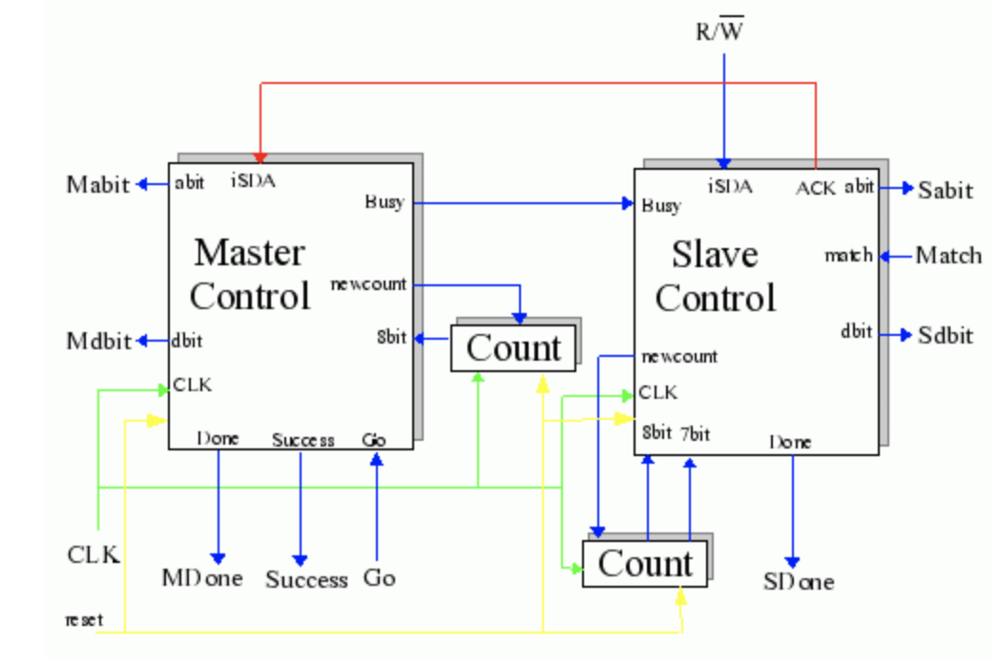

Given our work, we provided a demo for our class of our product. The purpose of this task was to test the operation of our Master and Slave Control units that we have done throught the semester by integrating them into the test circuit shown below:

<div class="ui small rounded images">
  
</div>

To prepare for the demo, we needed to:

  • Prepare a Master top level structural VHDL file which connects the Master
Control, AU, DU, and Count modules and create a Master part in your I2C
library. (NOTE: you will need to use tri-state drivers on the outputs of your AU
and DU enabled by abit and dbit, respectively, to generate the Master oSDA
signal. A process to do this in VHDL this might look like this.

  • Prepare a Slave top level structural VHDL file which connects the Slave Control,
AU, DU, and Count modules and create a Slave part in your I2C library.

  • Prepare a test top level which has one instance of your Master part and one
instance of your Slave part connected as follows:
      o the Master Busy output connected to the Slave Busy input,
  
      o the Slave ACK output connected to the Master iSDA input,
  
      o the Master oSDA output connected to the Slave iSDA input,
  
      o a common clock signal to both Master and Slave CLK inputs.
and create an I2C_test part in your library.

  • Create a LogicWorks circuit file with one instance of your I2C_test part
connected to switches, hex keypads, hex displays and probes to exercise your
design.


Circuit for slave control:
<div class="ui small rounded images">
  
</div>


Here is some of the VHDL for Slave Control:

```js
library IEEE;
use IEEE.std_logic_1164.all;
entity slavehw6 is
port(
iSDA : in std_logic;
bit7 : in std_logic;
bit8 : in std_logic;

3

reset : in std_logic;
Busy : in std_logic;
match : in std_logic;
ACK : out std_logic;
newcount : out std_logic;
abit : out std_logic;
dbit : out std_logic;
Done : out std_logic;
CLK : in std_logic
);
end slavehw6;

architecture arch1 of slavehw6 is
type statetype is (Idle, Addr, Dir, Waiting, Ackaddr, Data, Ackdata);
signal present_state, next_state : statetype := Idle;
begin
comb_process : process(present_state, iSDA, bit7, bit8, reset, Busy, match)
begin
case present_state is
when Idle =>
ACK <= '0'; newcount <= '0'; abit <= '0'; dbit <= '0'; Done <= '0';
if Busy = '1' then
newcount <= '1';
next_state <= Addr;
else
next_state <= Idle;
end if;
when Addr =>
ACK <= '0'; newcount <= '0'; abit <= '1'; dbit <= '0'; Done <= '0';
if bit7 = '1' then
next_state <= Dir;
else
next_state <= Addr;
end if;
when Dir =>
ACK <= '0'; newcount <= '0'; abit <= '0'; dbit <= '0'; Done <= '0';
if iSDA = '1' then
next_state <= Waiting;
elsif iSDA = '0' AND match = '1' then
next_state <= Ackaddr;

4

elsif iSDA = '0' AND match = '0' then
next_state <= Waiting;
end if;
when Waiting =>
ACK <= '0'; newcount <= '0'; abit <= '0'; dbit <= '0'; Done <= '0';
if Busy = '0' then
next_state <= Idle;
else
next_state <= Waiting;
end if;
when Ackaddr =>
ACK <= '1'; newcount <= '1'; abit <= '0'; dbit <= '0'; Done <= '0';
next_state <= Data;
when Data =>
ACK <= '0'; newcount <= '0'; abit <= '0'; dbit <= '1'; Done <= '0';
if bit8 = '1' then
next_state <= Ackdata;
else
next_state <= Data;
end if;
when Ackdata =>
ACK <= '1'; newcount <= '0'; abit <= '0'; dbit <= '0'; Done <= '1';
next_state <= Waiting;
if reset = '1' then
next_state <= Idle;
end if;
end case;
end process comb_process;
clk_process : process
begin
wait until (CLK'event AND CLK = '1');
present_state <= next_state;
end process clk_process;
end arch1;
```

You can learn more at the [Task Website](http://ee.hawaii.edu/~tep/EE260/Secret/task3.html) &
[See the finished work](https://docs.google.com/document/d/1jEuwWkm1gD7iVLl16eM64bXCBm80wY5aYX2AfWJ509s/edit?usp=sharing)


