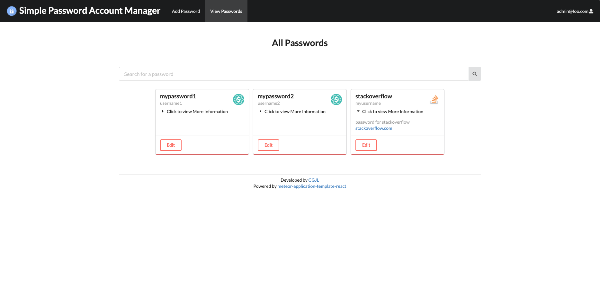

  

SPAM - Simple Password Account Manager is a password manager where users can sign up and save existing account information in a single space. Users can view all existing password items, update, delete, and make new password items all in a single master account. 

 

  
  
*Sample Adding Password

  

  
  
*Sample Editing Password

 

  
  
*Sample viewing all password Page

 

During this project, we spent a lot of time implementing and understanding secure coding practices. I learned a lot regarding risk analysis, safe and good practices, and how to identify threats using threat modeling. In this project we put a lot of emphasis in our documentation (see [here](https://github.com/CGJL/spam/blob/master/doc/Documentation.pdf)) where we layout all of these topics, design, and security requirements and more in depth.  

 

#### My contribution: 
* Created the user accounts page where user’s can view and sort all account and password information, populated the
database, and help set up the meteor template
* Determined necessary security and design requirements using secure coding practices and threat modeling, provided risk
assessment plan for security and privacy, and applied static analysis tools for our application

  

#### My Takeaways:
* Practicing secure coding practices are a necessity when developing and to help decrease the amount of security issues that may arise
* Dynamic and static analysis tools are beneficial throughout your development process
* The SDLC (Systems Development Life Cycle) can help transform your idea to a safe and functional application that covers necessary requirements for safe practices.

 

Click [here](https://github.com/CGJL/spam/wiki) to view our wiki and source code. 

 

  
