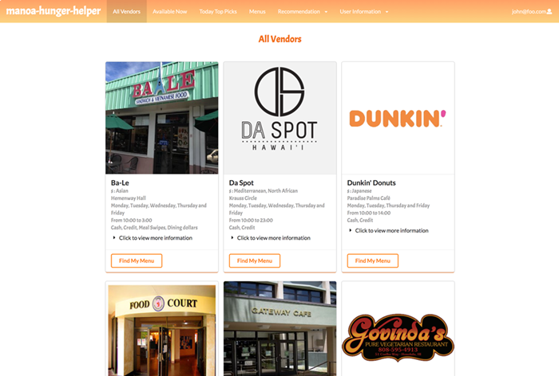
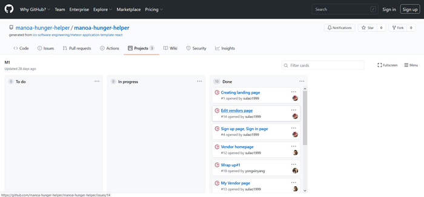

 

Manoa Hunger Helper is a Web Application made by myself and my fellow classmates [Yongxin](https://yongxinyang.github.io/), [Su](https://sulao1999.github.io/) and [Feimei](https://feimeichen.github.io/). Manoa Hunger Helper is an accessible web application that aimed to help UH Manoa students and faculty find all available vendors and food options on campus. Our application provides a solution to one of the hardest questions we ask ourselves in our day. Which is, ***what's for lunch?***

  

 

Our application provides users with detailed information regarding available vendors, location, hours, payment types and dietary options. Users can set preferences, and filter their results. Additionally, Vendors are able to create accounts for themselves to manage their accounts to modify their own information themselves. 

 

For this project we faced challenges that we overcame together as a group. Remote learning has been a difficult time for many of us, especially when trying to collaborate with your peers. We worked hard as a group to plan and create this project remotely. Active communication, and the use of milestones helped us make sure we were on track with each other. In this project we all had an equal amount of work, and an equal amount of say on the development of our project. Though no one was set a specific role, our active communication allowed us to effectively make decisions and divide responsibilities so that every one of us took part on all aspects of the development process. 

  

  

I am very grateful for the team I have worked with, and the skills I gained during this process. Some of my  main takeaways were: 
* A Hands on experience with a team
* Experiencing a deployment process
* A better understanding of mongoDB
* Proactive and effective communication

 

Click [here](https://manoa-hunger-helper.github.io/) to view our project home page.
 
[View Source Code](https://github.com/manoa-hunger-helper/manoa-hunger-helper)

