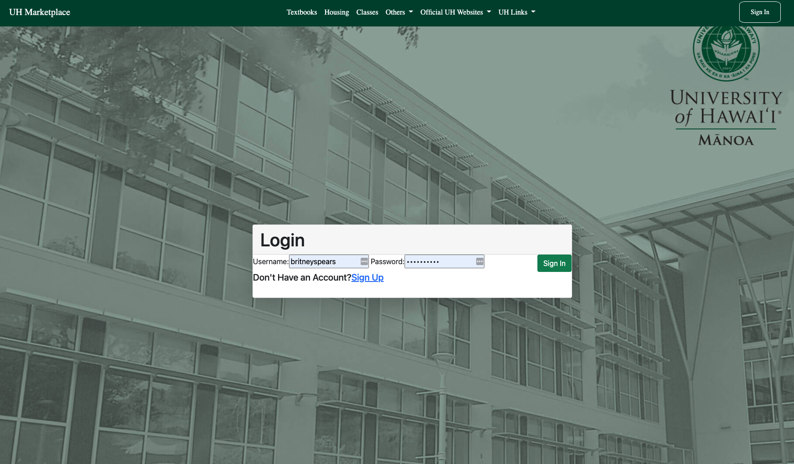
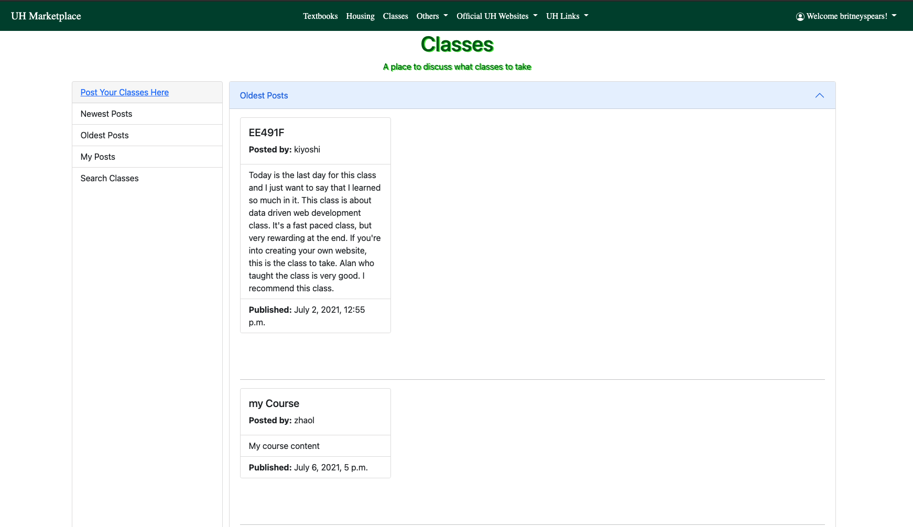
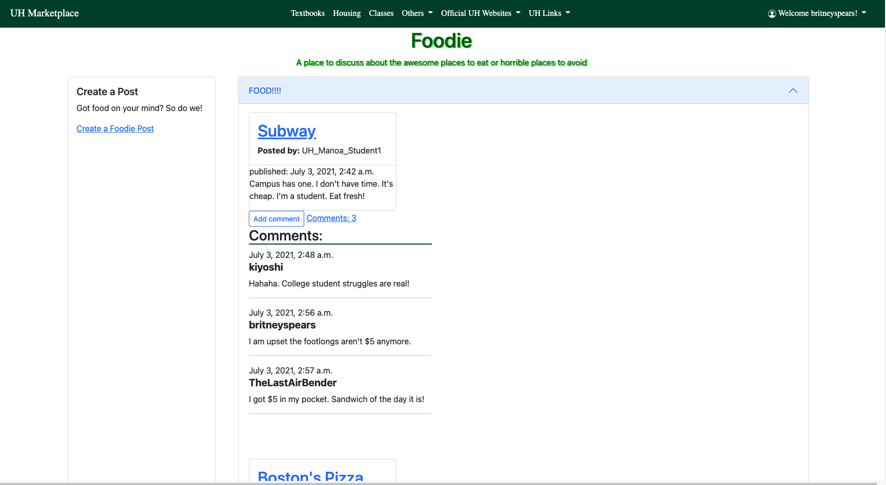

  

  

UH Marketplace is a web application designed for students at the University of Hawaiʻi at Mānoa. In this application, users are able to create an account and interact with other users by commenting, selling, and making posts.
#### Some of the features users can make include: 
* Create a post to sell textbooks
    * User can also edit, delete, their own post
* Users can view existing post and filter and sort by relevance
* Users can create post concerning class reccomendations and local dinning 
* Users can interact with these post by making comments

 

  
  
Example of Responsive UI - Landing page

  

  
  
Sign in page

  

  
  
Filtered class page by oldest post

 

  
  
Post and comments for food reviews

 

For this project we used Docker to package our application, Django for our web application framework, and bootstrap, CSS, and jQuery for styling. Our database was set up using PostgreSQL, and Heroku to deploy our application. Our team consited of 5 people, and everyone except myself had experience with programming. This project was made during our EE491F: Computer Science course, where it was an elective for Electrical Engineering students. This project provided several challenges for our team. Though I was not familiar with a lot of this tech stack at the beginning of this course, it was interesting to see the progression my team and myself have made over the course of the few weeks this class lasted. It provided me with the opportunity to take control and pair program. It was an interesting learning experience of having this role and transfering my knoweldge down.    

 

#### My contribution: 
* Created a full stack marketplace application for UH M¯anoa students that allows users to to interact with each other
using CRUD
* Set up our work environment using docker and django and created models and base templates for pages
* Gave structure and functional style to front-end design by using bootstrap and created responsive user interfaces

  

#### My Takeaways:
* Patience is key!
* Importance of laying down expectations and implementing safe practices during development
* No one gets left behind
* Communication between teammates is extremely vital, make sure everyone is on the same page

 

Click [here](https://uhmarketplace.herokuapp.com/uhmarketplace/) to view our deployed heroku website, and [here](https://github.com/EE491F-Revengers/UH-Marketplace/wiki) for our wiki and source code.  

 

  
